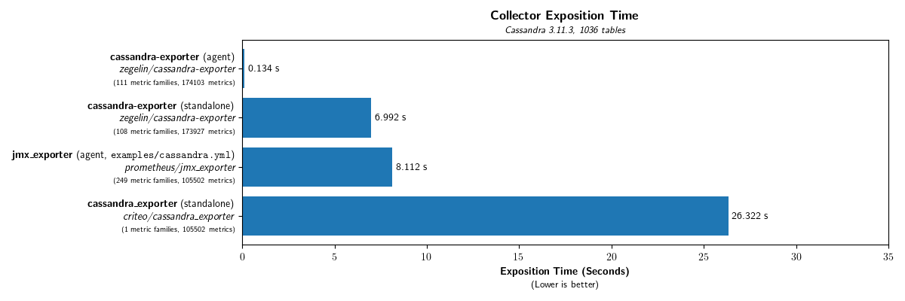

# cassandra-exporter 

*cassandra-exporter* is a Java agent (with optional standalone mode) that exports Cassandra metrics to [Prometheus](http://prometheus.io).

*Project Status: beta*

## Introduction

*cassandra-exporter* enables high performance collection of Cassandra metrics and follows the Prometheus best practices for metrics naming and labeling.

*cassandra-exporter* is fast. In a worst-case benchmark, where the Cassandra schema contains 1000+ tables (resulting in ~174 thousand metrics),
*cassandra-exporter* completes exposition in ~140ms. Compared to the next-best, *jmx_exporter*, which completes exposition in _~8 seconds_.
Other solutions can take _tens of seconds_, during which CPU time is consumed querying JMX and serialising values.

See the [Exported Metrics](https://github.com/instaclustr/cassandra-exporter/wiki/Exported-Metrics) wiki page for a list of available metrics.

All but a few select metrics exposed by *cassandra-exporter* are live with no caching involved.
The few that are cached are done so for performance reasons.

*cassandra-exporter* exports metric families, where the names, labels, metric types (gauge, counter, summary, etc), and value scales 
have been hand-tuned to produce easy-to-query output.

For example, the following PromQL query will return an estimate of the number of pending compactions per-keyspace, per-node.

    sum(cassandra_table_estimated_pending_compactions) by (cassandra_node, keyspace)

## Compatibility

*cassandra-exporter* is has been tested with:

| Component       | Version       |
|-----------------|---------------|
| Apache Cassandra| 3.0.17 (experimental), 3.11.2, 3.11.3        |
| Prometheus      | 2.0 and later |

Other Cassandra and Prometheus versions will be tested for compatibility in the future.

## Usage

### Agent

Download the [latest release](https://github.com/instaclustr/cassandra-exporter/releases/latest) and copy `cassandra-exporter-agent-<version>.jar` to `$CASSANDRA_HOME/lib` (typically `/usr/share/cassandra/lib` in most package installs).

Then edit `$CASSANDRA_CONF/cassandra-env.sh` (typically `/etc/cassandra/cassandra-env.sh`) and append the following:

    JVM_OPTS="$JVM_OPTS -javaagent:$CASSANDRA_HOME/lib/cassandra-exporter-agent-<version>.jar"

Then (re-)start Cassandra.

Prometheus metrics will now be available at <http://localhost:9500/metrics>.

### Standalone

While it is preferable to run *cassandra-exporter* as a Java agent for performance, it can instead be run as an external application if required.

Download the [latest release](https://github.com/instaclustr/cassandra-exporter/releases/latest) and copy `cassandra-exporter-standalone-<version>.jar` to a location of your choosing.

The exporter can be started via `java -jar /path/to/cassandra-exporter-standalone-<version>.jar`.

Prometheus metrics will now be available at <http://localhost:9500/metrics>.

In this mode metrics will be queried via JMX which will incur a performance overhead.
The standalone mode was originally designed to assist with benchmarking and development of the exporter.

The set of metrics available is close to that of the agent -- Gossiper related metrics are unavailable as these aren't readily available over JMX.

Currently some additional metadata labels, such as the table type (table, index, view, etc) attached to the `cassandra_table_*` metrics, are
not available (this feature has yet to be written).

### Prometheus Configuration

Configure Prometheus to scrape the endpoint by adding the following to `prometheus.yml`:

    scrape_configs:
      ...
      
      - job_name: 'cassandra'
        static_configs:
          - targets: ['<cassandra node IP>:9500', '<cassandra node IP>:9500', '<cassandra node IP>:9500', ...]

See the [Prometheus documentation](https://prometheus.io/docs/prometheus/latest/configuration/configuration/#%3Cscrape_config%3E) for more details on configuring scrape targets.

To view the raw, plain text metrics (in the Prometheus text exposition format), request the endpoint
(by default, <http://localhost:9500/metrics>) with a HTTP client such as a browser or cURL.

Experimental JSON output is also provided if the `Accept: application/json` header or `?x-accept=application/json` URL parameter is specified.
The format/structure of the JSON output is subject to change.

### Options

The available command line options may be seen by passing `-h`/`--help`:

    Usage: cassandra-exporter-standalone [-hV] [--enable-collector-timing]
                                         [--enable-per-thread-cpu-times]
                                         [--exclude-system-tables]
                                         [--no-fast-float] [--no-global-labels]
                                         [--no-table-labels] [--cql-address=
                                         [ADDRESS][:PORT]]
                                         [--cql-password=PASSWORD]
                                         [--cql-user=NAME] [--family-help=VALUE]
                                         [--jmx-password=PASSWORD]
                                         [--jmx-service-url=URL] [--jmx-user=NAME]
                                         [--exclude-keyspaces=<excludedKeyspaces>]..
                                         . [-g=LABEL[,LABEL...]]... [-l=[ADDRESS][:
                                         PORT]]... [-t=LABEL[,LABEL...]]...
                                         [-e=EXCLUSION...]...
      -g, --global-labels=LABEL[,LABEL...]
                                Select which global labels to include on all exported
                                  metrics. Valid options are: 'CLUSTER' (cluster name),
                                  'HOST_ID' (UUID of the node), 'NODE' (node endpoint IP
                                  address), 'DATACENTER' (DC name), 'RACK' (rack name).
                                  The default is to include all global labels except
                                  HOST_ID. To disable all global labels use
                                  --no-global-labels.
      -t, --table-labels=LABEL[,LABEL...]
                                Select which labels to include on table-level metrics.
                                  Valid options are: 'TABLE_TYPE' (table, view or
                                  index), 'INDEX_TYPE' (for indexes -- keys, composites
                                  or custom), 'INDEX_CLASS' (the index class name for
                                  custom indexes),  'COMPACTION_STRATEGY_CLASS' (for
                                  tables & views, compaction-related metrics only). The
                                  default is to include all table labels. To disable all
                                  table labels use --no-table-labels.
          --enable-per-thread-cpu-times
                                Collect per-thread CPU times, where each thread gets its
                                  own time-series. (EXPERIMENTAL)
          --enable-collector-timing
                                Record the cumulative time taken to run each collector
                                  and export the results.
          --exclude-keyspaces=<excludedKeyspaces>
    
          --no-global-labels    Disable all global labels.
      -e, --exclude=EXCLUSION...
                                Exclude a metric family or MBean from exposition.
                                  EXCLUSION may be the full name of a metric family
                                  (wildcards or patterns not allowed) or the ObjectName
                                  of a MBean or a ObjectName pattern that matches
                                  multiple MBeans. ObjectNames always contain a colon
                                  (':'). See the ObjectName JavaDoc for details. If
                                  EXCLUSION is prefixed with an '@', it is interpreted
                                  (sans @ character) as a path to a file containing
                                  multiple EXCLUSION values, one per line. Lines
                                  prefixed with '#' are considered comments and are
                                  ignored. This option may be specified more than once
                                  to define multiple exclusions.
          --no-table-labels     Disable all table labels.
          --no-fast-float       Disable the use of fast float -> ascii conversion.
          --exclude-system-tables
                                Exclude system table/keyspace metrics.
      -l, --listen=[ADDRESS][:PORT]
                                Listen address (and optional port). ADDRESS may be a
                                  hostname, IPv4 dotted or decimal address, or IPv6
                                  address. When ADDRESS is omitted, 0.0.0.0 (wildcard)
                                  is substituted. PORT, when specified, must be a valid
                                  port number. The default port 9500 will be substituted
                                  if omitted. If ADDRESS is omitted but PORT is
                                  specified, PORT must be prefixed with a colon (':'),
                                  or PORT will be interpreted as a decimal IPv4 address.
                                  This option may be specified more than once to listen
                                  on multiple addresses. Defaults to '0.0.0.0:9500'
          --family-help=VALUE   Include or exclude metric family help in the exposition
                                  format. AUTOMATIC excludes help strings when the user
                                  agent is Prometheus and includes them for all other
                                  clients (cURL, browsers, etc). Currently Prometheus
                                  discards help strings. Excluding help strings saves
                                  bandwidth. Can be overridden with the "?
                                  help=true|false" URI query parameter. Valid values:
                                  INCLUDE, EXCLUDE, AUTOMATIC. Defaults to AUTOMATIC.
          --jmx-service-url=URL JMX service URL of the Cassandra instance to connect to
                                  and collect metrics. Defaults to 'service:jmx:rmi:
                                  ///jndi/rmi://localhost:7199/jmxrmi'
          --jmx-user=NAME       JMX authentication user name.
          --jmx-password=PASSWORD
                                JMX authentication password.
          --cql-address=[ADDRESS][:PORT]
                                Address/hostname and optional port for the CQL metadata
                                  connection. Defaults to 'localhost:9042'
          --cql-user=NAME       CQL authentication user name.
          --cql-password=PASSWORD
                                CQL authentication password.
      -h, --help                Show this help message and exit.
      -V, --version             Print version information and exit.

Options may also be provided via an `@`-file:
    
- *Standalone*

      java -jar /path/to/cassandra-exporter-standalone-<version>.jar @/path/to/options/file
      
- *Agent*

      JVM_OPTS="$JVM_OPTS -javaagent:$CASSANDRA_HOME/lib/cassandra-exporter-agent-<version>.jar=@/path/to/options/file"
      
    `@$CASSANDRA_CONF/cassandra-exporter.options` is a good choice.

Note that `--jmx-service-url`, `--jmx-user`, `--jmx-password`, `--cql-address`, `--cql-user` and `--cql-password`
are only applicable to the standalone version -- the agent does not use JMX or CQL connections.

To protect the JMX password and prevent it from showing up in `ps`, `top` and other utilities, use an `@`-file that contains `--jmx-password=PASSWORD`.

When run as an agent, command line options must be provided as part of the `-javaagent` flag, with an equals sign (`=`) separating the JAR path and the agent options.
Multiple options, or option arguments can be separated by commas (`,`) or spaces. Commas are preferred as the whitespace quoting rules of `cassandra-env.sh` are quite complex.
Options with values containing whitespace must be quoted appropriately. Alternatively use an `@`-file (see above).

For example, to change the agent listening port to 1234 and exclude some metrics:

    JVM_OPTS="$JVM_OPTS -javaagent:$CASSANDRA_HOME/lib/cassandra-exporter-agent-<version>.jar=--listen=:1234,--exclude=@$CASSANDRA_CONF/prometheus-exclusions"
    

### Endpoints

- `/`
    
    Root document with links for convenience.
    
    *Content-type*: `text/html`
    
- `/metrics`

    Metrics exposition.
    
    *Content-type*: `text/plain;version=0.0.4`, `text/plain`, `application/json`
    
    *URI parameters*:
    
    - `x-accept=<mime>` -- override `Accept` header for browsers (e.g, `?x-accept=application/json` will force JSON output)
    - `help=true|false` -- include/exclude per-metric family help in the output. Overrides `--family-help` CLI option. See above for more details.

## Features

### Performance

JMX is *slow*, really slow. JMX adds significant overhead to every method invocation on exported MBean methods, even when those methods are called from within the same JVM.
On a 300-ish table Cassandra node, trying to collect all exposed metrics via JVM resulted in a collection time that was upwards of 2-3 *seconds*.
For exporters that run as a separate process there is additional overhead of inter-process communications and that time can reach the 10's of seconds.

*cassandra-exporter* on the same node collects all metrics in 10-20 *milliseconds*.

### Best practices

The exporter attempts to follow Prometheus' best practices for metric names, labels and data types.

Cassandras built-in aggregate metrics, such as the table-related metrics at the keyspace and node level, are skipped.
Instead only the table-level metrics are exported &mdash; aggregates can be computed on-the-fly using PromQL queries or once using Prometheus recording rules.

Unlike the metrics exported via JMX, where each table metric has a unique name, Cassandras metrics are coalesced when appropriate so they share the same exported metric family name, opting for *labels* to differentiate individual time series.
For example, each table level metric has a constant name and at minimum a `table` & `keyspace` label, which allows for complex PromQL queries.

For example the `cassandra_table_operation_latency_seconds[_count|_sum]` summary metric combines read, write, range read, CAS prepare, CAS propose and CAS commit latency metrics together into a single metric family.
A summary exposes percentiles (via the `quantile` label), a total count of recorded samples (via the `_count` metric),
and (if available, `NaN` otherwise) an accumulated sum of all samples  (via the `_sum` metric).

Individual time-series are separated by different labels. In this example, the operation type is exported as the `operation` label.
The source `keyspace`, `table`, `table_type` (table, view or index), `table_id` (CF UUID), and numerous other metadata labels are available.

    cassandra_table_operation_latency_seconds_count{keyspace="system_schema",table="tables",table_type="table",operation="read",...}
    cassandra_table_operation_latency_seconds_count{keyspace="system_schema",table="tables",table_type="table",operation="write",...}

    cassandra_table_operation_latency_seconds_count{keyspace="system_schema",table="keyspaces",table_type="table",operation="read",...}
    cassandra_table_operation_latency_seconds_count{keyspace="system_schema",table="keyspaces",table_type="table",operation="write",...}

These metrics can then be queried:

    sum(cassandra_table_operation_latency_seconds_count) by (keyspace, operation) # total operations by keyspace & type

Element                                              | Value
---------------------------------------------------- |------
`{keyspace="system",operation="write"}`              | 13989
`{keyspace="system",operation="cas_commit"}`         | 0
`{keyspace="system",operation="cas_prepare"}`        | 0
`{keyspace="system",operation="cas_propose"}`        | 0
`{keyspace="system",operation="range_read"}`         | 10894
`{keyspace="system",operation="read"}`               | 74
`{keyspace="system_schema",operation="write"}`       | 78
`{keyspace="system_schema",operation="cas_commit"}`  | 0
`{keyspace="system_schema",operation="cas_prepare"}` | 0
`{keyspace="system_schema",operation="cas_propose"}` | 0
`{keyspace="system_schema",operation="range_read"}`  | 75
`{keyspace="system_schema",operation="read"}`        | 618

### Global Labels

The exporter does attach global labels to the exported metrics.
These may be configured with the `--global-labels` (or disabled via `--no-global-labels) CLI option.

These labels are:

- `cassandra_cluster`

    The name of the cluster, as specified in cassandra.yaml.
    
- `cassandra_host_id`

    The unique UUID of the node. _Not enabled by default_
    
- `cassandra_node`

    The IP address of the node.
    
- `cassandra_datacenter`

    The configured data center name of the node.
    
- `cassandra_rack`

    The configured rack name of the node.
    
These labels allow aggregation of metrics at the cluster, data center and rack levels.

While these labels could be defined in the Prometheus scrape config, we feel that having these labels be automatically
applied simplifies things, especially when Prometheus is monitoring multiple clusters across numerous DCs and racks.

## Exported Metrics

See the [Exported Metrics](https://github.com/instaclustr/cassandra-exporter/wiki/Exported-Metrics) wiki page for a list.

We suggest viewing the metrics endpoint (e.g., <http://localhost:9500/metrics>) in a browser to get an understanding of what metrics
are exported by your Cassandra node.

## Unstable, Missing & Future Features

See the [project issue tracker](https://github.com/instaclustr/cassandra-exporter/issues) for a complete list.

- Embedded HTML metrics viewer

    Early versions supported outputting metrics as a HTML document for easier viewing in a browser.
    
    The format writer was complicated and we didn't want to add dependencies on a templating library (e.g. Freemarker) to make it simpler.
    Instead the JSON format writer has been improved and optimized with the intent that the data could be consumed by simple static JavaScript webapp. 

- Add some example queries
- Add Grafana dashboard templates
- Documentation improvements
- Improve standalone JMX exporter
    - Systemd service file
    - Package
    
- Packages for standard distributions (Debian, Fedora, Arch, etc) that install the JARs in the correct locations.

Please see https://www.instaclustr.com/support/documentation/announcements/instaclustr-open-source-project-status/ for Instaclustr support status of this project.
